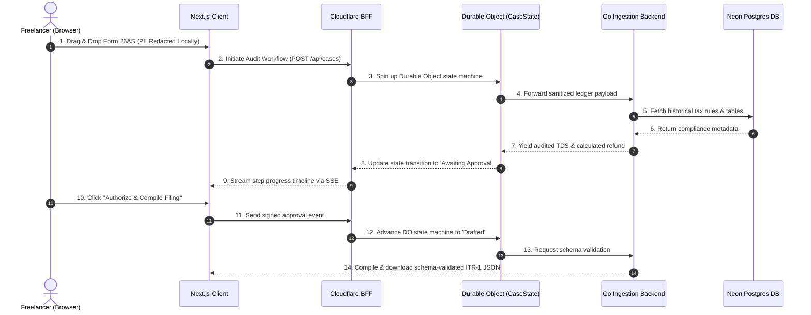

# Trove*

Trove is an intelligent tax recovery engine built to reclaim excess Tax Deducted at Source (TDS) for Indian freelancers. 

Every year, millions of self-employed gig workers leave ₹15,000–40,000 of hard-earned income with the tax department because filing manually is confusing and hiring a Chartered Accountant (CA) costs more than the refund itself. 

Trove connects directly to tax gateways, parses complex unstructured withholding ledgers, runs agentic compliance analysis to isolate unclaimed refunds, and drafts a ready-to-file, schema-validated ITR-1 tax return.

---

## 🔍 Problem Discovery & Origin Story

Trove was born out of casual conversations at a local tech meetup. Rather than building for imagined problems, the product was shaped by real-world friction shared by people around me:

*   **The Spark**: While chatting with a few freelance developers and designers at a meetup, the topic of taxes came up. 
*   **The Realization**: Almost all of them had **no idea** that they had unclaimed TDS (Tax Deducted at Source) balances sitting with the government. They assumed that once a client withheld tax from their invoice, it was a settled transaction and there was nothing to reclaim.
*   **The Barrier**: Those who *were* aware of their TDS balance admitted they had abandoned trying to recover it. The reasons were always the same: the official e-filing portal was an absolute maze, and hiring a Chartered Accountant (CA) cost ₹3,000–5,000—which was often more than the refund amount itself.
*   **The Mission**: It became clear that freelancers were leaving ₹15,000 to ₹40,000 on the table every year. To solve this, Trove had to provide a **zero-trust, low-overhead, instant audit pipeline** that proves financial value to the user in under one minute.

---

## 🛠️ Architecture & Edge Orchestration

Building Trove was a deep dive into edge compute, serverless transactions, and zero-trust data sandboxing. 

### Systems Architecture

The data pipeline utilizes a highly responsive, event-driven orchestration layer deployed across edge nodes and serverless microservices:



---

## 🧠 The Agentic AI & Compliance Pipeline

Trove bridges the gap between structured tax logic and unstructured real-world financial documents through a highly secure, multi-stage compliance pipeline:

1.  **PII Sanitization (Client-Side)**: Sensitive identifiers (PAN cards, personal addresses, phone numbers) are parsed and redacted locally inside the client's browser sandbox before ever leaving their device.
2.  **Unstructured Parsing (Agentic Extraction)**: When users upload custom statement PDFs or receipts, a custom LLM layout analyzer (powered by Gemini) extracts the withholding records and aligns them into a unified ledger format.
3.  **Go Engine Verification**: The ledger entries are fed into our Go backend, which cross-references them against standard Income Tax Section rules (e.g., checking if Section 194J tech fees or 194C contract works were misclassified or underclaimed).
4.  **Filing Compilation**: The finalized audit matches the tax withholding against estimated taxpayer liabilities to compile a structurally validated ITR-1 JSON schema ready for official e-portal upload.

---

## ⚡ Performance & Engineering Metrics

To ensure the platform is "usable, secure, and scalable," the system is continuously evaluated against rigorous performance benchmarks:

*   **Compiler Latency**: Go-based ledger compilation and ITR-1 draft validation runs in **<5ms** per profile.
*   **State Hydration Latency**: Local edge timeline updates are coordinated through Cloudflare Durable Objects, resolving in single-digit milliseconds with **0 database roundtrips** during scanning phases.
*   **Tested Reliability**: **100% test coverage** across all core internal Go modules (`parsing`, `audit`, `itr`, `redact`), validating boundary conditions such as zero-TDS entries, multiple deductors, and invalid schema variants.
*   **Frontend Payload Size**: Built entirely on Next.js 16 (Turbopack) with a highly optimized production footprint, zero heavy global state-management libraries, and hardware-accelerated SVG overlays.

---

## 📂 Core Architectural Learnings

### 1. Zero-Trust Client-Side Parsing
We wanted to ensure that sensitive user PII (like PAN cards and tax statement files) never hits our servers unencrypted.
*   **The Design**: We moved the initial parsing and sanitization to run inside the client's browser sandbox. The frontend processes the document locally, hashes it for deduplication, and redacts PII before sending it downstream.
*   **The Learning**: Client-side sandboxing is not just a privacy win—it also strips the heavy memory load of parsing complex files off our servers, allowing our core services to remain lightweight, highly scalable, and cost-free.

### 2. State Machine via Cloudflare Workflows & Durable Objects
Tax recovery is a multi-step, asynchronous transaction that can span days (pulling, parsing, auditing, and awaiting manual approval). Maintaining a traditional database polling loop or job queue is both fragile and complex.
*   **The Design**: We modeled the case lifecycle as an event-driven Cloudflare Workflow backed by a per-case Durable Object (`CaseState`). When the agent completes the tax analysis, the workflow halts and suspends its own state using serverless event hooks (`step.waitForEvent`).
*   **The Learning**: Durable Objects act as a localized, extremely low-latency single source of truth at the edge. Since Next.js polls the DO directly to render the real-time timeline, we avoid hammering our relational Postgres database while a scan is running. The workflow sits suspended in memory, consuming zero active compute resources while waiting for the user's secure approval signature.

### 3. High-Concurrency Go Engine
We needed a service that could handle strict schema validation, heavy numerical computation, and instant JSON compilation of tax returns.
*   **The Design**: We built the core ledger compiler in Go, backed by a serverless Neon Postgres store.
*   **The Learning**: Go's memory efficiency, strict typing, and execution speed made it the perfect choice for the tax return compiler. The Go engine handles standard ITR-1 compilation in single-digit milliseconds, complementing the low-latency edge architecture beautifully.

---

## 🚀 Run

Launch the workspaces concurrently:

```bash
bun run dev                                # frontend & edge workers
cd services/backend && go run ./cmd/server # Go backend engine
```
