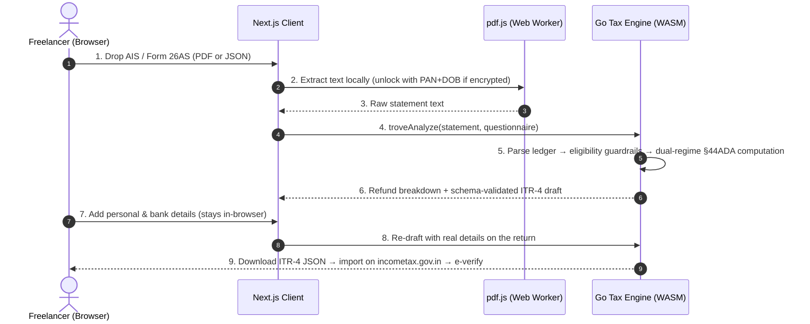

# Trove*

Trove is an intelligent tax recovery engine built to reclaim excess Tax Deducted at Source (TDS) for Indian freelancers. 

Every year, millions of self-employed gig workers leave ₹15,000–40,000 of hard-earned income with the tax department because filing manually is confusing and hiring a Chartered Accountant (CA) costs more than the refund itself. 

Trove parses AIS / Form 26AS statements entirely inside the browser, runs a deterministic §44ADA presumptive-tax computation through a Go engine compiled to WebAssembly, and drafts a ready-to-file, schema-validated ITR-4 tax return — without a single byte of financial data ever leaving the user's device.

---

## 🔍 Problem Discovery & Origin Story

Trove was born out of casual conversations at a local tech meetup. Rather than building for imagined problems, the product was shaped by real-world friction shared by people around me:

*   **The Spark**: While chatting with a few freelance developers and designers at a meetup, the topic of taxes came up. 
*   **The Realization**: Almost all of them had **no idea** that they had unclaimed TDS (Tax Deducted at Source) balances sitting with the government. They assumed that once a client withheld tax from their invoice, it was a settled transaction and there was nothing to reclaim.
*   **The Barrier**: Those who *were* aware of their TDS balance admitted they had abandoned trying to recover it. The reasons were always the same: the official e-filing portal was an absolute maze, and hiring a Chartered Accountant (CA) cost ₹3,000–5,000—which was often more than the refund amount itself.
*   **The Mission**: It became clear that freelancers were leaving ₹15,000 to ₹40,000 on the table every year. To solve this, Trove had to provide a **zero-trust, low-overhead, instant audit pipeline** that proves financial value to the user in under one minute.

---

## 🛠️ Architecture: Everything Runs in the Browser

Building Trove was a deep dive into WebAssembly, client-side document processing, and zero-trust design taken to its logical conclusion: there is no server-side data path at all. The entire tax engine ships to the user.

### Systems Architecture



The user stays the filer of record — Trove never logs into the portal or files on anyone's behalf.

---

## 🧠 The Compliance Pipeline

Trove bridges the gap between structured tax logic and unstructured real-world financial documents through a deterministic, multi-stage pipeline — with the LLM-free guarantee that **no AI ever computes a number**:

1.  **Local Document Extraction**: AIS / Form 26AS PDFs (including password-protected ones — the password is just PAN + DOB, derived in-browser) are text-extracted by pdf.js inside a Web Worker. AIS JSON exports are parsed by a structure-agnostic walker that recognises records by section codes and amounts rather than assuming the portal's exact key names.
2.  **Ledger Parsing**: The Go engine reconstructs the withholding ledger — multi-row deductors, §197 zero-TDS certificates, Indian lakh-grouped amounts, TCS entries, and SFT capital-gains signals all handled.
3.  **Eligibility Guardrails**: Before computing a single rupee, the engine checks whether ITR-4 is actually the right form. Capital gains, non-professional income (§194C contract work), receipts above the §44ADA ceiling, foreign assets — any of these and Trove refuses to draft, explains why, and points to ITR-3. A wrong refusal beats a wrong refund.
4.  **Dual-Regime Computation**: Gross receipts → §44ADA deemed income → both tax regimes computed in full (slabs, §87A rebate with marginal relief, surcharge, cess, capped Chapter VI-A deductions) → whichever leaves the user more money wins.
5.  **Filing Compilation**: The draft is compiled into the official `{"ITR":{"ITR4":…}}` structure — including per-deductor TDS/TCS schedules — validated against the **official CBDT ITR-4 JSON schema**, and checked against ~25 of the portal's Category-A validation rules so the e-filing portal accepts what Trove produces.

---

## ⚡ Performance & Engineering Metrics

To ensure the platform is "usable, secure, and scalable," the system is continuously evaluated against rigorous benchmarks:

*   **Zero Bytes Uploaded**: Statements, PAN, refund amounts, bank details — everything is parsed and computed on-device. Open the network tab and watch: the only fetches are the static site and the 4MB `trove.wasm` engine itself.
*   **Compiler Latency**: Go-based ledger parsing, dual-regime computation, and ITR-4 compilation complete in **single-digit milliseconds** per profile — instant even on mid-range phones.
*   **Tested Reliability**: **98.9% coverage** on the compute engine (93.2% parsing, 88.4% ITR compilation), backed by a 1,512-combination invariant grid (refund⊕payable exclusivity, regime monotonicity, marginal-relief windows), golden fixtures, and a native Go fuzz target that has chewed through **780k+ hostile inputs** without a crash.
*   **Schema-Proven Output**: Every draft validates against the official CBDT ITR-4 schema in CI, and the portal's cross-field business rules (refund = taxes paid − liability, schedule totals, rebate ceilings) are re-checked inside the browser on every single draft.
*   **Frontend Payload Size**: Built on Next.js 16 (Turbopack) as a fully static site, zero heavy global state-management libraries, hardware-accelerated SVG overlays.

---

## 📂 Core Architectural Learnings

### 1. Ship the Engine, Not the Data
We wanted to ensure that sensitive user PII (PAN cards, tax statements, bank accounts) never hits a server — encrypted or otherwise.
*   **The Design**: Instead of sanitizing data before sending it to a backend, we deleted the backend. The entire Go tax engine compiles to WebAssembly (`GOOS=js GOARCH=wasm`) and runs inside the browser; pdf.js handles document extraction in a Web Worker; a tight CSP (`wasm-unsafe-eval`, no broad `unsafe-eval`) keeps the sandbox honest.
*   **The Learning**: "We can't see your data" is a much stronger promise than "we protect your data" — and it's architecturally verifiable by anyone with DevTools. It also made the product free to operate: there is no compute bill for a tax engine the user runs themselves.

### 2. Guardrails Beat Guesses
Tax software that silently produces a wrong return is worse than no software. A freelancer with ₹12L of §194C contract income looks almost identical to one with §194J professional fees — but only one of them can legally file ITR-4.
*   **The Design**: Eligibility is a hard gate in front of the computation. Every signal that suggests ITR-4 is the wrong form (capital-gains SFT entries, mixed income sections, receipt ceilings, foreign assets) returns an explicit `not-eligible:<reason>` instead of a draft, surfaced to the user with the honest recommendation to use ITR-3 or a CA.
*   **The Learning**: Refusing ~30% of cases is what makes the other ~70% trustworthy. The bounce message is a feature, not a failure state.

### 3. The Official Schema Is an Executable Spec
The e-filing portal rejects returns for reasons far beyond JSON shape — cross-field arithmetic, schedule consistency, rebate ceilings — documented across a 246KB JSON schema and a 24-page validation-rules PDF.
*   **The Design**: The real CBDT ITR-4 schema is embedded in the Go engine and every draft validates against it in CI. The portal's Category-A business rules are encoded as a deterministic rule-checker that inspects the exact bytes the user will file — and because it's pure Go, it runs in WASM, so the browser enforces portal rules before the user ever leaves the page.
*   **The Learning**: Encoding the rules immediately caught a bug the schema alone never would have: drafts claimed TDS credit without the per-deductor schedule rows the portal demands. Schema-valid and portal-rejected are two very different things — treat the regulator's rulebook as a test suite.

---

## 🚀 Run

```bash
bun install

# compile the Go tax engine to WebAssembly (needs Go 1.26+)
bun run --cwd web build:wasm

# launch the app
bun run --cwd web dev          # http://localhost:3000
```

Run the test suites:

```bash
cd services/backend && go test -race ./...   # engine: invariants, goldens, fuzz corpus, schema validation
bun run --cwd web test                       # web helpers
```

> ⚠️ Trove prepares your return; you review and file it yourself on [incometax.gov.in](https://www.incometax.gov.in/iec/foportal/). Tax parameters are pending independent CA verification — treat drafts as a starting point, not advice.
